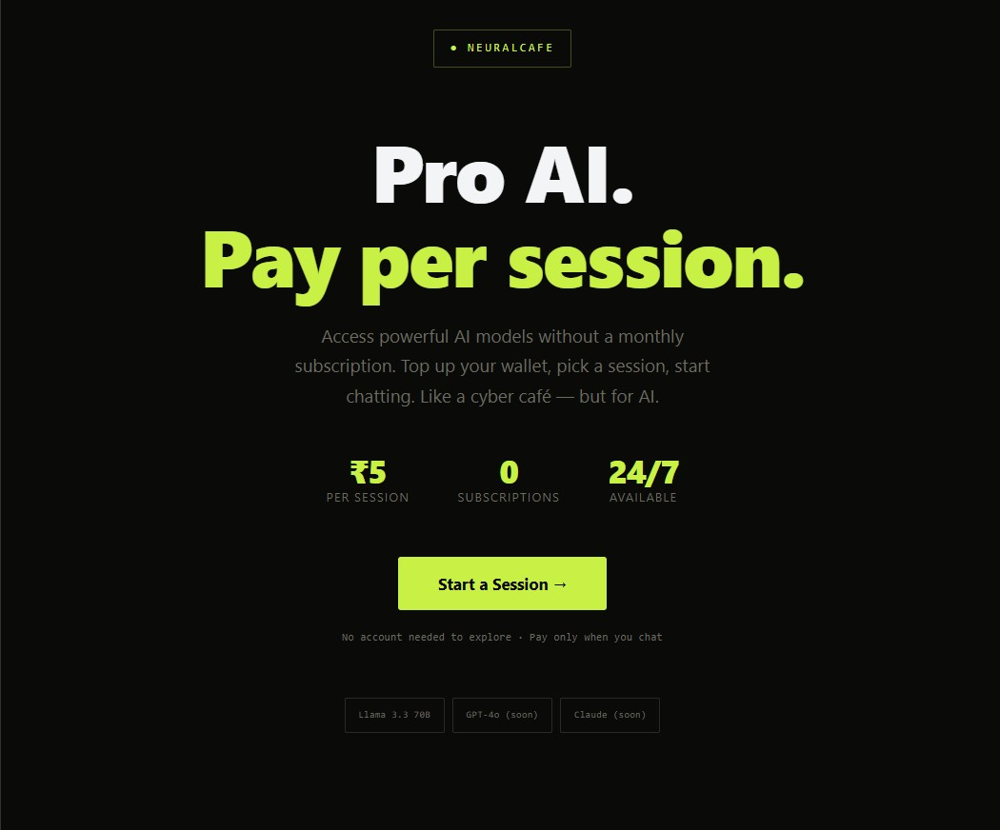
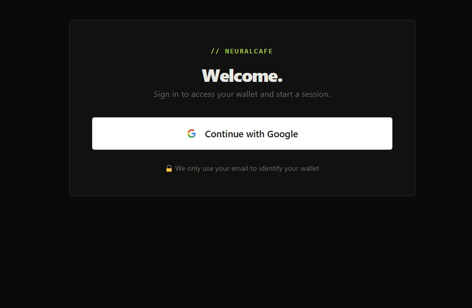
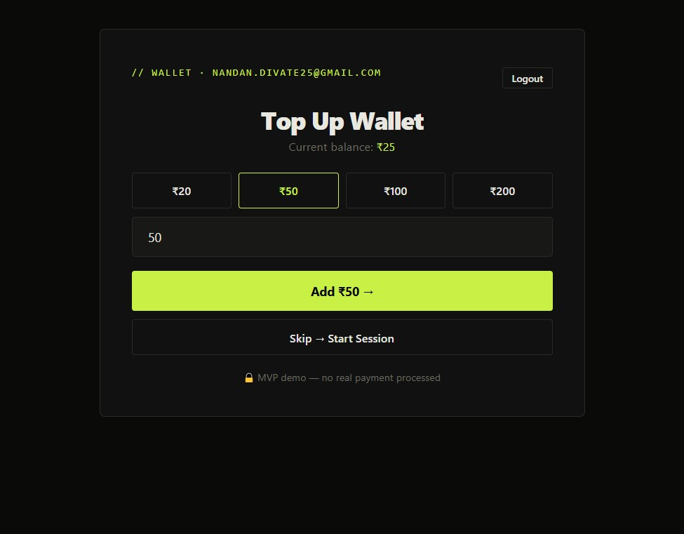
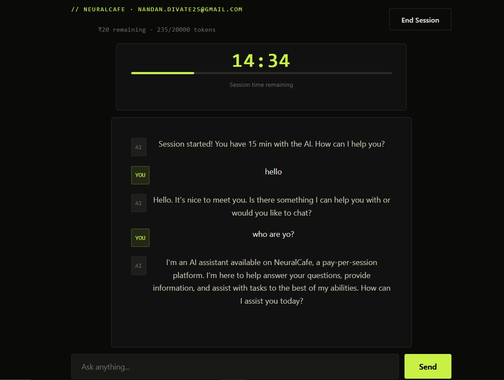

# NeuralCafe ⚡

> **Pay-per-session AI access. No subscriptions. No commitments.**

Like a cyber café — but for AI. Top up your wallet, pick a session duration, and chat with powerful AI models. Pay only for what you use.

🔗 **Live Demo:** [neuralcafe-mvp.vercel.app](https://neuralcafe-mvp.vercel.app)

---

## Screenshots

| Landing | Login | Wallet | Chat |
|---|---|---|---|
|  |  |  |  |

---

## Features

- **Google Authentication** — one-click sign in, works on mobile and desktop
- **Persistent Wallet** — top up balance that never expires across sessions
- **Timed Sessions** — choose 15 min (₹5), 30 min (₹10), or 1 hour (₹18)
- **Real AI Chat** — powered by Llama 3.3 70B via Groq API
- **Token Tracking** — live token usage counter per session
- **Session Timer** — real-time countdown with visual progress bar
- **8+ Active Users** — live and growing

---

## Tech Stack

| Layer | Technology |
|---|---|
| Frontend | React + Vite |
| Backend | Node.js + Express |
| Database | Supabase (PostgreSQL) |
| Authentication | Firebase (Google OAuth) |
| AI Model | Llama 3.3 70B via Groq API |
| Frontend Deploy | Vercel |
| Backend Deploy | Render |

---

## How It Works

```
User signs in with Google
        ↓
Tops up wallet (UPI/card — Razorpay coming soon)
        ↓
Picks a session plan (15min / 30min / 1hr)
        ↓
Balance deducted → Session starts with timer
        ↓
Chats with AI — tokens tracked in real time
        ↓
Session expires → Buy another session
```

---

## Architecture

```
React Frontend (Vercel)
        ↓
Node.js Backend (Render)
        ↓
┌───────────────────┐
│   Groq API        │ ← AI responses
│   Supabase        │ ← Users, wallets, sessions
│   Firebase Auth   │ ← Google login
└───────────────────┘
```

---

## Session Pricing

| Plan | Duration | Price | Token Limit |
|---|---|---|---|
| Quick | 15 min | ₹5 | 20,000 |
| Standard | 30 min | ₹10 | 40,000 |
| Deep Work | 1 hour | ₹18 | 80,000 |

---

## Local Setup

### Prerequisites
- Node.js v18+
- Groq API key (free at console.groq.com)
- Supabase project
- Firebase project

### Backend
```bash
cd backend
npm install
# Set environment variables (see below)
node server.js
```

### Frontend
```bash
cd frontend
npm install
npm run dev
```

### Environment Variables (Backend)
```
GROQ_API_KEY=your_groq_key
SUPABASE_URL=your_supabase_url
SUPABASE_ANON_KEY=your_supabase_anon_key
PORT=3001
```

---

## Database Schema

```sql
-- Users
CREATE TABLE users (
  id UUID PRIMARY KEY,
  email TEXT UNIQUE NOT NULL,
  created_at TIMESTAMP DEFAULT NOW()
);

-- Wallets
CREATE TABLE wallets (
  id UUID PRIMARY KEY,
  user_id UUID REFERENCES users(id),
  balance NUMERIC DEFAULT 0
);

-- Sessions
CREATE TABLE sessions (
  id UUID PRIMARY KEY,
  user_id UUID REFERENCES users(id),
  plan TEXT NOT NULL,
  ends_at TIMESTAMP NOT NULL,
  tokens_used INTEGER DEFAULT 0,
  max_tokens INTEGER NOT NULL,
  created_at TIMESTAMP DEFAULT NOW()
);
```

---

## Roadmap

- [x] Google authentication
- [x] Persistent wallet system
- [x] Timed AI sessions
- [x] Token tracking
- [x] Live deployment
- [ ] Razorpay UPI payments
- [ ] GPT-4o and Claude Sonnet integration
- [ ] Session history
- [ ] Mobile app

---

## Built By

**Nandan A Divate**  
B.E. Computer Science and Engineering ·  Dayananda Sagar Academy of Technology and Management
[GitHub](https://github.com/NandanDivate) · [LinkedIn](https://www.linkedin.com/in/nandandivate)

---

> *"Why pay ₹1,700/month for a subscription when you only need AI for 30 minutes?"*
